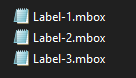
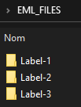
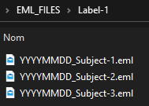

# MBOX Parser
Forked from [gmail-mbox-splitter](https://github.com/nekobrain/gmail-mbox-splitter).

Splits Google Takeout MBOX files into single EML files. 
Keeps your labels as folders and name emails as `<date>_<subject>.eml`.

## Example
From 

 
 
To 

